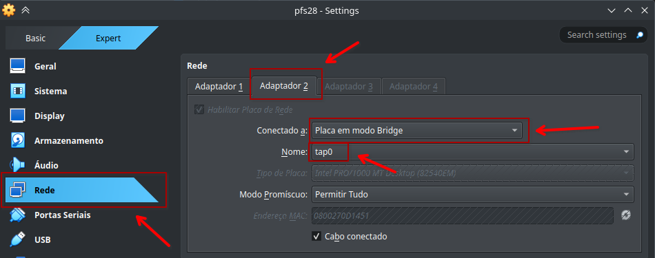
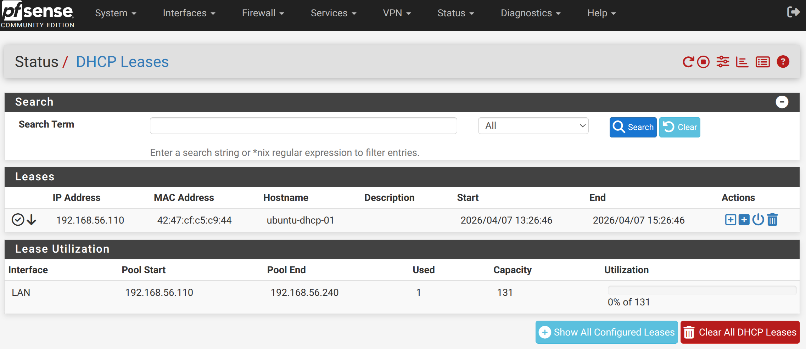

# Containers que pegam IP por DHCP do pfSense

## Roteiro:
1. Desligar o pfSense
2. Criar interfaces virtuais no host
3. Trocar no Virtualbox para que a interface 2 do pfSense seja a tap0 no modo bridge e religar pfSense
4. Instalar `isc-dhcp-client` e `iproute2` na imagem do container que se pretende receber IP por DHCP
5. Subir container SEM rede e com privilégios no contexto de rede
6. Criar interface virtual para plugar a tun0 com o namespace do container
7. Subir o link no container e fazer DHCPREQUEST pelo dhclient

### 1. Desligar o pfSense

### 2. Criar bridge e tap no Linux, plugar a bridge na tuntap e subir a interface tap
```
sudo ip link add bridge-tap type bridge
sudo ip link set bridge-tap up
sudo ip tuntap add dev tap0 mode tap
sudo ip link set tap0 master bridge-tap
sudo ip link set tap0 up
```

### 3. Trocar no Virtualbox para que a interface 2 do pfSense seja a tap0 no modo bridge


### 4. Instalar pacotes necessários (Exemplo com container novo, vazio)
```
docker run -d --name ubuntu-tmp ubuntu:24.04 sleep infinity
docker exec ubuntu-tmp apt update
docker exec ubuntu-tmp apt install -y isc-dhcp-client iproute2 iputils-ping
docker commit ubuntu-tmp ubuntu-dhcp
docker rm -f ubuntu-tmp
```
> [!IMPORTANT]
> O que foi feito aqui foi a instalação dos pacotes em um container zerado, depois as modificações foram commitadas em uma nova imagem, e a imagem temporária foi removida, passando a só usar a imagem com os pacotes embutidos.

### 5. Subir container SEM rede mas com privilégios no contexto de rede
docker run -d --name ubuntu-dhcp-01 --hostname ubuntu-dhcp-01 --network none --cap-add NET_ADMIN --cap-add NET_RAW ubuntu-dhcp:latest sleep infinity

### 6. Criar interface virtual para plugar a tun0 com o namespace do container
```
CPID=$( docker inspect -f '{{.State.Pid}}' ubuntu-dhcp-01 )
sudo ip link add veth-host-01 type veth peer name veth-cont-01
sudo ip link set veth-host-01 master bridge-tap
sudo ip link set veth-host-01 up
sudo ip link set veth-cont-01 netns "${CPID}"
```

### 7. Subir manualmente o link e pedir IP por DHCP
```
docker exec ubuntu-dhcp-01 ip link set lo up
docker exec ubuntu-dhcp-01 ip link set veth-cont-01 name eth0
docker exec ubuntu-dhcp-01 ip link set eth0 up
docker exec ubuntu-dhcp-01 dhclient -v eth0
```

### Verificar o IP do container:
```
docker exec ubuntu-dhcp-01 ip address show eth0
```



## Para rodar um segundo container, basta (por exemplo):
```
docker run -d --name ubuntu-dhcp-02 --hostname ubuntu-dhcp-02 --network none --cap-add NET_ADMIN --cap-add NET_RAW ubuntu-dhcp:latest sleep infinity
C02PID=$( docker inspect -f '{{.State.Pid}}' ubuntu-dhcp-02 )
sudo ip link add veth-host-02 type veth peer name veth-cont-02
sudo ip link set veth-host-02 master bridge-tap
sudo ip link set veth-host-02 up
sudo ip link set veth-cont-02 netns "${C02PID}"
docker exec ubuntu-dhcp-02 ip link set lo up
docker exec ubuntu-dhcp-02 ip link set veth-cont-02 name eth0
docker exec ubuntu-dhcp-02 ip link set eth0 up
docker exec ubuntu-dhcp-02 dhclient -v eth0
```
